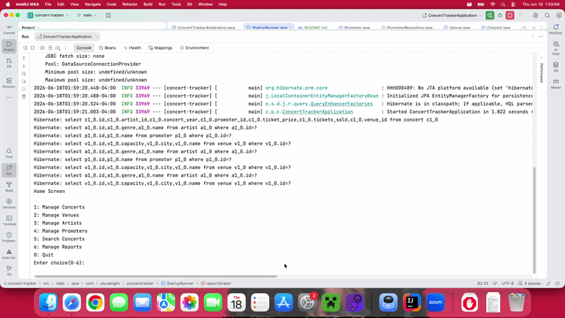
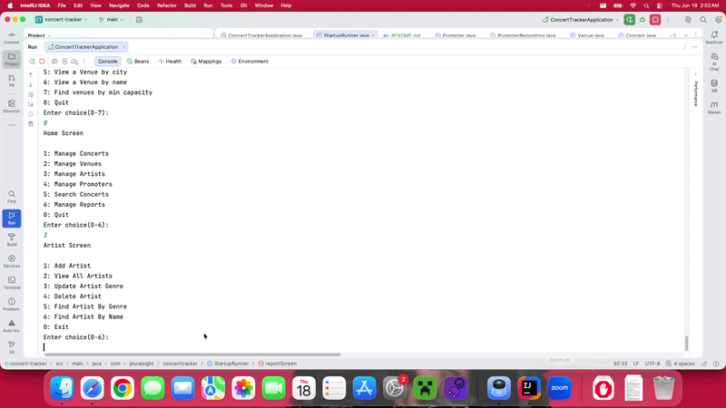
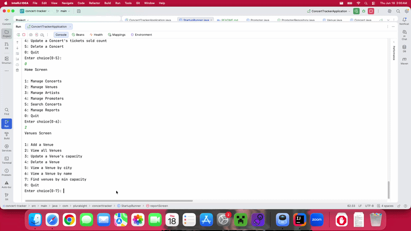
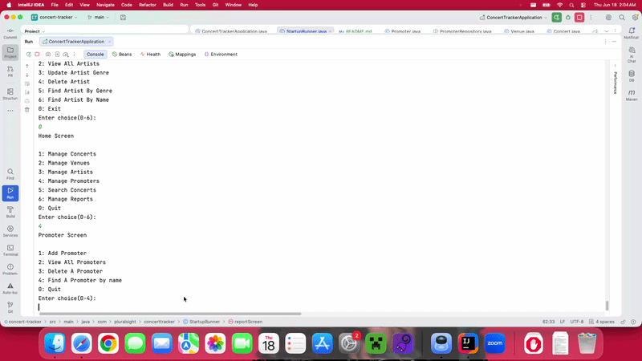
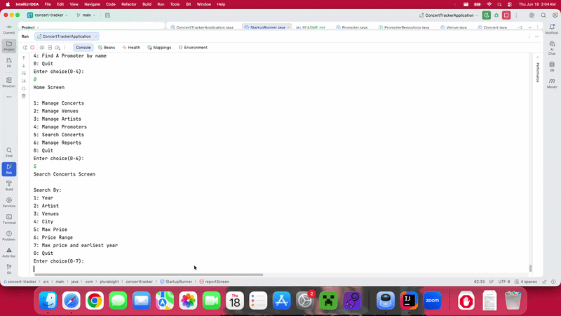
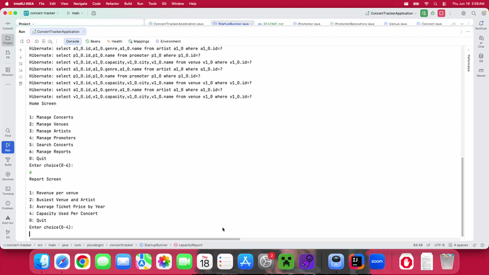

# Concert Tracker

## Description of the Project

A simple CLI application that is built using Spring boot and JPAs.
Helps users manage all data such as concerts, artists, venues, and promoters
which now all stored in a MySQL database. Also, managing means having the ability
to add,view, update, delete from our database to keep all info up to date.
We even have different filters to search for concerts and can also create differnt
reports you might wanna see.

## Setup

Instructions on how to set up and run the project using IntelliJ IDEA.

### Prerequisites

- IntelliJ IDEA: Ensure you have IntelliJ IDEA installed, which you can download
  from [here](https://www.jetbrains.com/idea/download/).
- Java SDK: Make sure Java SDK is installed and configured in IntelliJ.

### Running the Application in IntelliJ

Follow these steps to get your application running within IntelliJ IDEA:

1. Open IntelliJ IDEA.
2. Select "Open" and navigate to the directory where you cloned or downloaded the project.
3. After the project opens, wait for IntelliJ to index the files and set up the project.
4. Find the main class with the `public static void main(String[] args)` method.
5. Right-click on the file and select 'Run 'YourMainClassName.main()'' to start the application.

## Technologies Used

- Java: Mention the version you are using.
- Any additional libraries or frameworks used in the project.

## Demo

- Concert

- Artist

- Venue

- Promoter

- Filters

- Reports

## Future Work

Outline potential future enhancements or functionalities you might consider adding:

- Have better formatting
- Colorful ClI
-

## Resources

List resources such as tutorials, articles, or documentation that helped you during the project.

- https://www.geeksforgeeks.org/advance-java/derived-query-methods-in-spring-data-jpa-repositories/
- https://raymaroun.github.io/yearup-java-visuals/week-10/index.html

## Team Members

- **Nurbu** - Developer.

## Thanks

Express gratitude towards those who provided help, guidance, or resources:

- Thank you to [Raymond] for continuous support and guidance.
- A special thanks to all teammates for their dedication and teamwork.
 